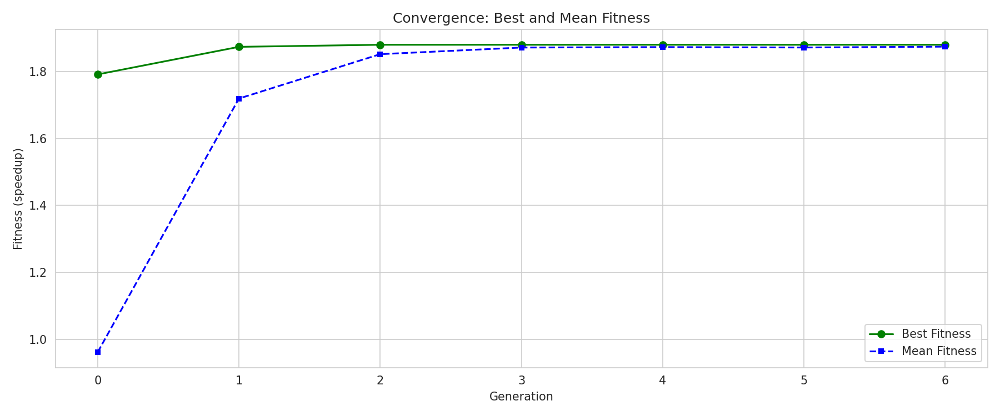
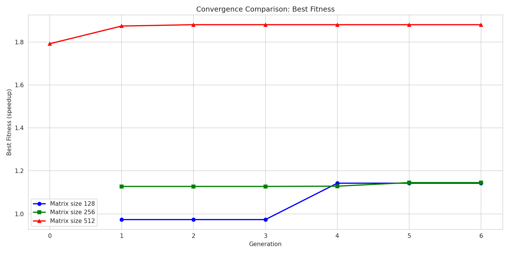

## Genetic Algorithm for CUDA Kernel Optimization
### Methodology : 
Initial benchmarking of the LLM prior to fine-tuning highlighted two key observations:
- The model was capable of identifying relevant optimization techniques.
- The generated CUDA kernels frequently contained compilation errors.
These observations motivated the exploration of an alternative optimization paradigm based on Genetic Algorithms (GA), where the LLM is used as a guidance mechanism rather than as a direct code generator.
The proposed methodology consists of the following steps:
1. Defining parameterized templates for the targeted CUDA operations, including matrix multiplication and convolution.
2. Defining the optimization configuration space (tile size , block size x , block size y , padding ...etc) and associated search parameters.
3. Applying a Genetic Algorithm using crossover and mutation operators to explore candidate kernel configurations.
4. Using the LLM as a decision-making component to guide transformation selection and candidate evaluation. 

### Experiments and Results: 
The experimental evaluation was conducted at multiple levels, with each experiment designed to validate a specific hypothesis regarding the proposed optimization framework.
1. *Stability and Convergence of the Method* \
   To evaluate the robustness of the proposed approach, the Genetic Algorithm was executed multiple times on the matrix multiplication kernel. Across different runs, the optimization process consistently converged around the third generation, achieving speed-ups of up to 1.8× compared to the baseline implementation.
   
2. *Generalization Across Matrix Sizes* \
   The proposed optimization strategy was evaluated on matrices of varying dimensions to assess its ability to adapt to different computational workloads while maintaining performance improvements.
   
   we can clearly see that form small matrices, the kernel didn't generalize well, this is a limitation that shall be highlighted. 
3. *Generalization Across CUDA Kernels* \
   The framework was further tested on different CUDA kernels, including convolution operations, in order to evaluate the transferability of the learned optimization strategy across multiple operator types.